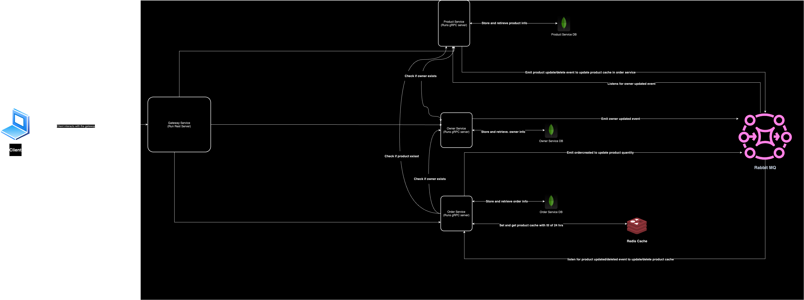

# crimmy-services

## Installation Guide
To run this application, you need to have only docker and docker-compose installed on your machine.

1. Clone the repository
```bash
git clone https://github.com/Babatunde13/crimmy-services.git
```

2. The `Makefile` contains some useful commands to help you run the application. You can run the following command to start the application:
```bash
make setup # This command will generate the proto files and .env files that's needed for the services to run
```

3. If you want to run with docker compose, you can run the either of following command:
a.
```bash
make run # This command will start the application with docker-compose
```
b.
```bash
docker-compose up -d # This command will start the application with docker-compose
```

4. If you want to run the services without docker, you can run the following command:
```bash
make install # This command will install the dependencies for the services
```
Then you'll have to naviagte to each service and run the following command in each service:
```bash
npm run start
```


The following are going to run in the dockjer compose
- `mongodb`: This is the database service, it uses a volume to persist the data on the host machine
- `rabbitmq`: This is the message broker service, it uses a volume to persist the data on the host machine
- `order-service`: This service is responsible for handling orders
- `product-service`: This service is responsible for handling products
- `owner-service`: This service is responsible for handling owners
- `gateway`: This service is responsible for routing http requests to the appropriate service

The internal services communicates with each other via rabbitmq. The `gateway` service is the only service that is exposed to the outside world.

## Documentation
The documentation is in the `/api/v1/docs` route. You can access it by visiting `http://localhost:4000/api/v1/docs` in your browser if you start the app with docker or to the port where the gateway runs after modifying it.

### Owner Service
The owner service is responsible for handling owners. The service handles registering an owner, logging in an owner, getting an owner, and updating an owner.

### Product Service
The product service is responsible for handling products. The service handles creating a product, getting a product, getting all products, updating a product, and deleting a product.

### Order Service
The order service is responsible for handling orders. The service handles creating an order, getting an order, getting all orders, updating an order.

## Architectural Diagram




## Next Steps
1. Use the grpc proto library to generate typescript files from the proto files.
2. Move the proto files and generated typescript files to a common repository and publish it as Github package, this will make it easier to share the proto files and generated typescript files across services instead of copying the files to each service.
3. Add tests to each services.
